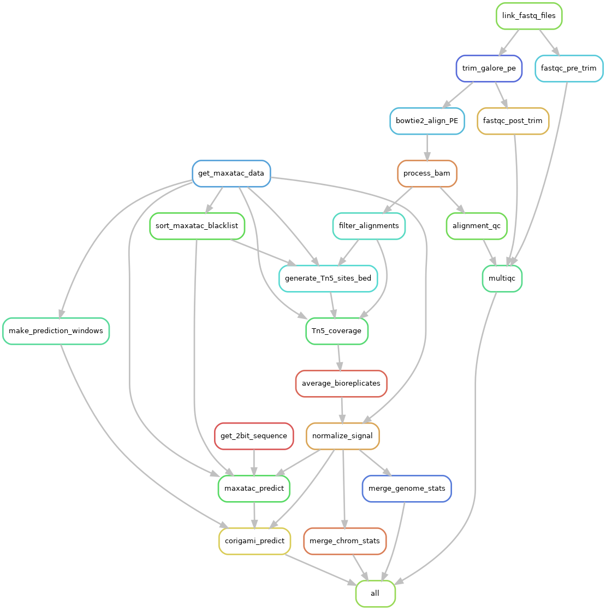

## Introduction

Pipeline to predict HiC matrices from ATAC-seq fastq files using [maxATAC](https://github.com/MiraldiLab/maxATAC) and [C.Origami](https://github.com/tanjimin/C.Origami)

## Setup

If you are working on Ultraviolet (aka BigPuprle) you need to setup an environment.
Which means you need to install snakemake and mamba (so a conda within a conda).

```bash
module load anaconda3/gpu
conda create -n snakemake -c conda-forge -c bioconda mamba snakemake
```

To configure conda to work on Ultraviolet you can edit the `ultraviolet.yaml` that comes with
this repo to match your liking and copy it to your `.config` directory as shown.

```bash
mkdir -p ~/.config/snakemake/ultraviolet/
cp ultraviolet.yaml ~/.config/snakemake/ultraviolet/config.yaml
```

## Execute

To run the pipeline you need to:

1. create a samplesheet with information about your samples
2. setup a directory with with data to run `C.Origami`
3. edit the `config/config.yaml` file to specify the paths to the relevant directories.

### Samplesheet

The samplesheet should have information about sample and replicate names and the path to the fastq files.
See the `config/sample_meta.csv` that comes with this directory for an example.

Alternatively you can specify a column called `Run` with the `SRR` ids of the samples and the pipeline should automatically download them for you (NOT TESTED).

### C.Origami Directory

The C.Origami directory should look like this:

```
<corigami_base>/
├── data
│   ├── <genome>
│   │   ├── centrotelo.bed
│   │   └── dna_sequence
│   │       ├── chr10.fa.gz
│   │       ├── chr11.fa.gz
│   │       ├── ...
│   │       ├── chrX.fa.gz
│   │       └── chrY.fa.gz
│   └── <genome>_tiles.bed
└── model_weights
    └── <corigami_model>.ckpt
```

Where `corigami_base`, `genome` and `corigami_model` are specified in `config/config.yaml`.

The `<corigami_base>/data` directory can be:

- Downloaded from [here](https://zenodo.org/record/7226561/files/corigami_data.tar.gz?download=1) (you will need to `untar` it)
- If you work from within Ultraviolet, symlinked from here: `/gpfs/data/tsirigoslab/home/jt3545/hic_prediction/C.Origami-release/corigami_data/`


To get the model weights you need to:
  - Train your own model and save the checkpoint. Ask [Javier Rodriguez Hernaez](mailto:Javier.RodriguezHernaez@nyulangone.org) for details.
  - Download a pretrained hg38 model checkpoint created by Javier from [here](https://genome.med.nyu.edu/public/tsirigoslab/c-origami_pretrained_models/maxatac_hg38.ckpt).
    If in Ultraviolet symlink/copy the following path: `/gpfs/home/rodrij92/PROJECTS/SHARE/epoch=53-step=64260.ckpt`

### config.yaml

The main parameter you may need to specify are:

- *genome*: either `hg38` or `mm10`
- *sample_meta*: path to samplesheet
- *corigami_base*: directory with C.Origami data
- *corigami_model*: name of checkpoint file under `<corigami_base>/model_weights`

### Run

If you have specify everything correctly you can launch the pipeline by executing the following commands on Ultraviolet:

```bash
conda activate snakemake  # activate environment you created in Ultraviolet if you don't have snakemake
snakemake --profile ultraviolet
```

### Pipeline Graph



### Predicting Simple Translocations

The repo has the script `workflow/scripts/predict_translocation.py` (still under development) that is not part of the pipeline, 
but can be used to predict the result of *simple translocations*. Simple translocations are defined as a merger of 2 chromosomes
at a specific position (no indels or substitutions involved). Below is a schematic of all the simple translocations:


These translocations are defined in a VCF file like this:

```
#CHROM   POS    ID      REF   ALT            QUAL FILTER  INFO
2     321681    bnd_W    G    G]17:198982]    6    PASS    .
2     321682    bnd_V    T    ]13:123456]T    6    PASS    .
13    123456    bnd_U    C    C[2:321682[     6    PASS    .
13    123457    bnd_X    A    [17:198983[A    6    PASS    .
17    198982    bnd_Y    A    A]2:321681]     6    PASS    .
17    198983    bnd_Z    C    [13:123457[C    6    PASS    .
```

These specify translocations can be given as arguments to `predict_translocation.py` as follows (embed them in single quotes to stop bash from interpreting the symbols): 

- `chr2:321681]chr17:198982]`
- `]chr13:123456]chr2:321682`
- `chr13:123456[chr2:321682[`
- `[chr17:198983[chr13:123457`
- `chr17:198982]chr2:321681]`
- `[chr13:123457[chr17:198983`
